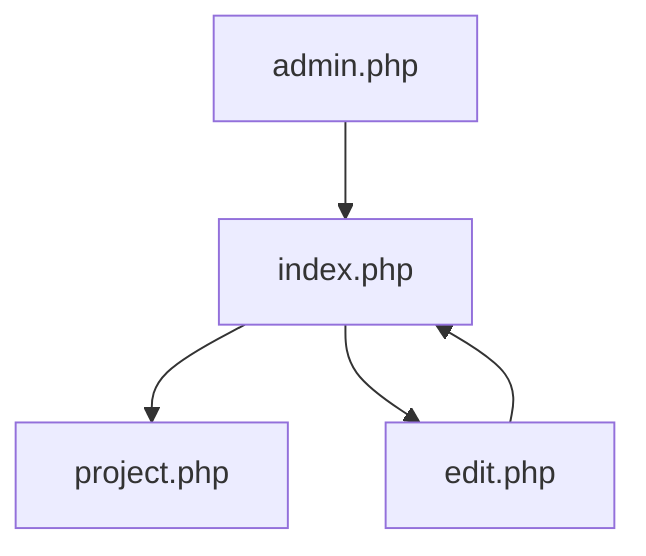

---

# Project Gallery Suite

**Author:** John C. 
**Last Updated:** September 2025  
**Environment:** Windows Server (IIS) + PHP + MySQL  
**Deployment Type:** Local-only, internal use (no external dependencies)

---

## Overview

This suite provides a modular gallery system for uploading, viewing, editing, and managing categorized project entries. It is designed for AV/IT teams, classrooms, or enterprise environments requiring fast, auditable project tracking with minimal abstraction.

---

## Features

- Topic-based categorization
- Image upload and preview
- Optional detailed info and document attachment
- Full-scale image viewing on dedicated `project.php` page
- Inline editing and deletion with confirmation
- Responsive layout with dark theme styling
- Automatic folder creation (`upload/`, `files/`)
- Embedded PHP logic; no frameworks or external libraries

---

## Folder Structure

```
/ProjectGallery/
│
├── admin.php           # Topic creation + project upload
├── edit.php            # Edit and delete existing projects
├── index.php           # Main gallery view
├── index_alt.php       # Optional alternate gallery layout
├── project.php         # Full image and metadata viewer
│
├── db.php              # Database connection script
├── css/
│   └── style.css       # Optional external stylesheet
├── upload/             # Stores uploaded images
├── files/              # Stores uploaded documents (PDF, DOCX, etc.)
```

> Note: `upload/` and `files/` folders are auto-created if missing during upload.

---

## System Requirements

- **Operating System:** Windows Server 2016 or later  
- **Web Server:** IIS with PHP handler mappings configured  
- **PHP Version:** 7.4 or higher (tested with 8.x)  
- **Database:** MySQL 5.7+ or MariaDB  
- **Permissions:** IIS user must have write access to `/upload/` and `/files/`

---

## Database Schema

### `topics`
```sql
CREATE TABLE topics (
    id INT AUTO_INCREMENT PRIMARY KEY,
    name VARCHAR(255) NOT NULL
);
```

### `projects`
```sql
CREATE TABLE projects (
    id INT AUTO_INCREMENT PRIMARY KEY,
    topic_id INT NOT NULL,
    image VARCHAR(255),
    description TEXT,
    details TEXT,
    document VARCHAR(255),
    created_at TIMESTAMP DEFAULT CURRENT_TIMESTAMP,
    FOREIGN KEY (topic_id) REFERENCES topics(id)
);
```

---

## Navigation Flow



---

## Security Notes

| Concern              | Recommendation                            |
|----------------------|--------------------------------------------|
| File type validation | Add MIME checks for uploads                |
| CSRF protection      | Implement tokens for form submissions      |
| File cleanup         | Add unlink logic on deletion               |
| Input sanitization   | Already using `intval()` and `real_escape_string()` |

---

## Deployment Notes

- Place all files inside a virtual directory under `C:\inetpub\wwwroot\ProjectGallery`  
- Ensure PHP is properly mapped in IIS (`.php` handler)  
- Create a MySQL database and import the schema above  
- Update `db.php` with your local database credentials  
- Access the system via `http://localhost/ProjectGallery/index.php`

---

## Usage Scenarios

- Classroom project archiving  
- Internal AV/IT documentation tracker  
- Visual showcase for team workflows  
- Lightweight CMS for internal tools

---

## Author Credit

Built and documented by **John C.**, a pragmatic systems thinker focused on clarity, speed, and maintainability.  
For training, onboarding, or extension requests, refer to this README or contact the project maintainer.

---


